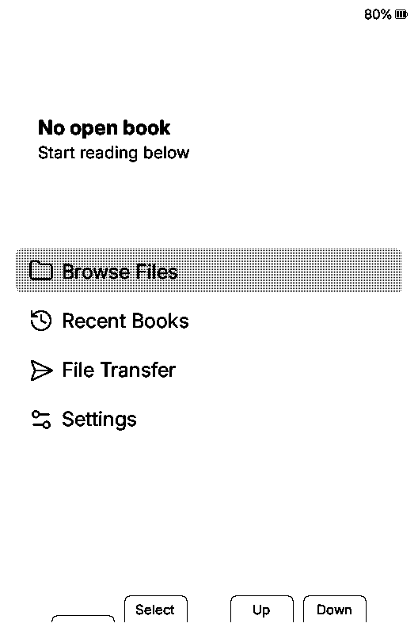

# Xteink X3 emulator

Run unchanged CrossInk firmware on an emulated ESP32-C3/Xteink X3, with a local
front panel, real button inputs, writable flash and persistent SD storage. The
CPU executes the actual mask ROM, bootloader, FreeRTOS application and drivers.
The panel displays the native grayscale framebuffer.

The working emulator and launcher are on `main`. Actual CrossInk v1.6.0 boots,
indexes an EPUB, turns pages, saves progress and restores the saved page on a
new CPU. Both the ROM downloader and the pinned official modern RAM flasher
program its complete bootable flash, with every byte checked afterward.

## Download and run

Open the latest successful **main** run of
[Tests](https://github.com/Klohto/xteink-x3-emulator/actions/workflows/tests.yml)
and download its `xteink-x3-crossink-linux-x86_64-<commit>` artifact. Unzip the
artifact, extract the enclosed `.tar.gz`, and run from the extracted directory
on **Ubuntu 24.04 x86-64**:

```sh
sudo apt-get install python3 libglib2.0-0t64 libpixman-1-0 libgcrypt20 zlib1g libslirp0 libzstd1 libncursesw6 libtinfo6
python3 launch.py
```

Open the printed loopback address. Enter confirms, Backspace goes back, arrows
navigate and P presses Power. Home → Browse → `test.epub` opens an original
generated book; wait for indexing before turning pages. Credentials, settings
and progress are not seeded into the bundled card. Press Back to save progress at Home.
Ctrl-C stops the CPU and
preserves its actual flash, SD card, eFuse, native trace and logs in the printed
run directory. Resume from those written files:

```sh
python3 launch.py --resume /absolute/path/to/previous/run
```

To use your own books:

```sh
python3 -m x3emu.sdcard --output /tmp/my-card.img --file /absolute/path/to/book.epub
python3 launch.py --sd /tmp/my-card.img
```

Launch needs no downloads or third-party Python packages. `--wifi` explicitly
enables networking. The prebuilt archive requires Python 3.11+ and glibc 2.38+;
build from source for a different host. See
[runtime-package.md](docs/runtime-package.md) for integrity checks, custom
flash, output directories, dependencies and corresponding QEMU source.

## See CrossInk working

These are lossless captures of the actual emulated panel, rotated for portrait
viewing. GIF playback is paced for inspection and is not a speed measurement.



[Bookmarks](docs/evidence/handoff/working-crossink-bookmarks.gif),
[clippings](docs/evidence/handoff/working-crossink-clippings.gif), and
[fonts](docs/evidence/handoff/working-crossink-fonts.gif) have equivalent native
demonstrations. [Working emulator](docs/working-emulator.md) links the actual
functional evidence and exact backend identities.

## Flash CrossInk

Build the backend and prepare the pinned firmware inputs first:

```sh
python -m pip install esptool==5.1.0
python -m x3emu.firmware --download --directory local/firmware
python scripts/test-serial-flash.py --output /tmp/x3-rom-flash
python scripts/test-serial-flash.py --stub --output /tmp/x3-modern-ram-flash
```

Both paths use the real UART downloader. The modern path uploads the unchanged
official ESP32-C3 flasher v1.3.0 using esptool's normal stub API. Compressed and
uncompressed transfers and subsequent CrossInk reading have separate proofs.
The assembled 16 MiB image contains the unchanged official application, a
compatible SDK bootloader, generated partitions and official OTA data; it is
not a factory dump. See [flashing.md](docs/flashing.md) and
[modern flasher validation](docs/ram-flasher-validation-2026-10-04.md), including
the preserved legacy-stub failure.

The [online OTA gate](docs/online-ota.md) exercises the original Check for
Updates action on a direct-network GitHub runner. It requires the actual
official v1.6.1 app in the alternate slot, a real reboot into that version,
EPUB page turns and saved progress restored by a fresh CPU. The host's own
release preflight and download do not count as guest update success.

## Build from source

Install the native dependencies in [build.md](docs/build.md), then:

```sh
python3 -m venv .venv
. .venv/bin/activate
python -m pip install -e '.[validation]' 'meson==1.8.5' 'pycotap==1.3.1'
./scripts/build-qemu.sh --fetch --test --jobs 4
python -m x3emu.firmware --download --directory local/firmware
python -m x3emu.sdcard --output /tmp/x3-card.img
python -m x3emu run --flash local/firmware/crossink-v1.6.0-x3-full-flash.bin --sd /tmp/x3-card.img --output /tmp/x3-run
```

Start the front panel in another terminal:

```sh
python -m x3emu ui --run-dir /tmp/x3-run --port 8080
```

Each run uses private writable copies of its inputs. Build and firmware
preparation make explicit downloads with pinned hashes. Commands and controls
are in [run.md](docs/run.md) and [ui.md](docs/ui.md).

## Devices and verified scope

| Component | Digital behavior |
| --- | --- |
| CPU and memory | ESP32-C3 RV32 execution, interrupts, mask ROM, SRAM, RTC RAM and flash mapping |
| Flash and SD | Writable 16 MiB SPI flash, UART programming, OTA partition switching, SPI SD commands and persistent FAT writes |
| Controls and panel | Two ADC button ladders, GPIO3 Power, native timer pulses, UC8253/UC8279 commands, grayscale planes, BUSY and 792 × 528 output |
| I2C | C3 command/FIFO/interrupt path, BQ27220 gauge, DS3231 RTC and QMI8658 IMU |
| Console and sleep | UART, USB Serial/JTAG FIFO, stock CRC file commands, RTC/GPIO wake, retained state and distinct watchdog reset domains |
| Experimental Wi-Fi | MAC/DMA/TSF, raw peers, source-backed RX and bounded native CCMP; actual secure Save/reconnect/Forget, GTK1 DHCP, hotspot and captive DNS |

The selected board patch passes 123 native cases across 12 suites. The
[function ledger](docs/function-coverage.md) tracks executed firmware proofs
for reading formats, navigation, bookmarks, dictionaries, clippings, layout,
fonts, settings, sleep, controls, USB, SD update, Nearby, OPDS, KOReader,
statistics and quick actions. Each receipt retains its exact backend identity
and original verdicts. Original failures and known
[stock firmware limitations](docs/stock-firmware-limitations.md) are preserved.

Complete hardware equivalence and exhaustive function coverage are not
established. Physical CPU/cache costs, SD latency, RF, panel optics, power and
analog sensors need real X3 measurements. The earlier online OTA probe retains
its observed proxy TLS trust failure; full online OTA remains unverified until
the direct-network gate passes. BLE and parts of protection/debug hardware
remain incomplete. The bounded encrypted Wi-Fi profile does not cover every
cipher or radio behavior.

`timing_calibrated`, `speed_selection_allowed`, `all_functions_verified` and
`complete_machine_verified` remain false. Functional firmware experiments are
possible; timing scores cannot yet select faster firmware.
[Native CCMP validation](docs/native-ccmp-validation.md),
[network validation](docs/network-validation.md) and the
[recovery record](docs/emulator-recovery-2026-10-04.md) retain exact limits and
prior source/receipt history.

## Checks

```sh
python -m unittest discover -s tests -v
./scripts/build-qemu.sh --test --jobs 4
python scripts/smoke-crossink.py --output /tmp/x3-reading-proof
python scripts/test-crossink-functions.py --output /tmp/x3-functions-proof
```

GitHub Actions runs Python 3.11/3.12 checks and builds/tests the pinned native
backend. Successful main builds also package the runnable front panel, virgin
storage, firmware, source and notices. Firmware proofs separately verify
actual pixels, written media, cold restoration and complete native traces.
Packaging or unit tests alone do not prove firmware behavior.
